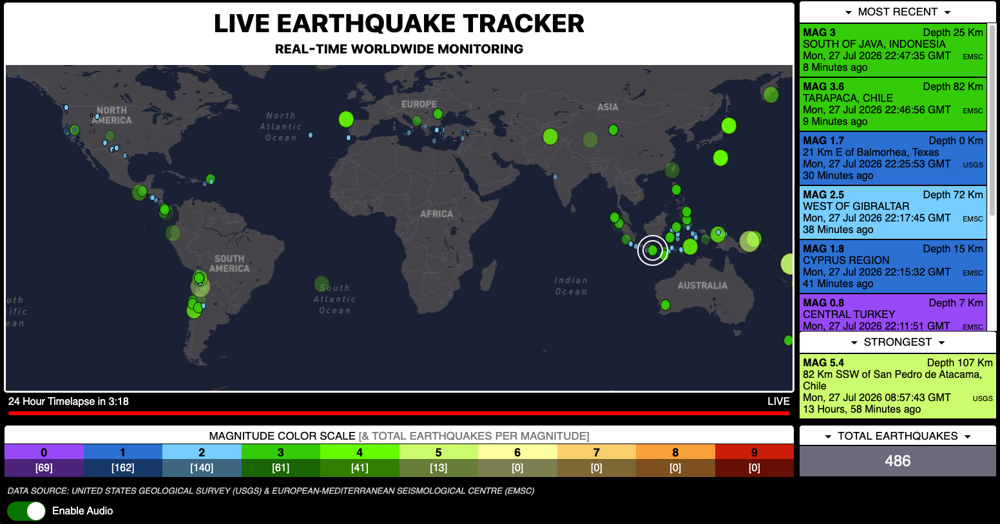

# Live Earthquake Tracker


A responsive web application that visualizes real-time global earthquake activity over the last 24 hours using USGS data, live EMSC WebSocket alerts, and Mapbox GL JS.

The application combines data from multiple public earthquake sources, plots events on a world map, highlights new earthquakes with animated target rings, reports tsunami information when available, and optionally plays an audio notification for newly detected earthquakes.

## Screenshot



🌍 **Live Demo:** [https://nerdsty.com/livetrackers/earthquakes]

## Features

-   Interactive Mapbox GL JS map
-   Real-time global earthquake monitoring
-   Tsunami reporting (when available from source data)
-   Animated earthquake target-ring visualization
-   Live earthquake activity feed
-   Displays the strongest active earthquake
-   Earthquake statistics
-   Optional audio notifications
-   Responsive dashboard layout
-   Custom interface built with HTML, CSS Grid, and JavaScript

## Technologies

### Frontend

-   HTML5
-   CSS3
-   JavaScript (ES6)

### Mapping

-   Mapbox GL JS

### Data Sources

-   USGS Earthquake API
-   EMSC earthquake feed (WebSocket)

## Technical Highlights

This project demonstrates:

-   Consuming multiple public data sources
-   Working with REST APIs and WebSockets
-   Parsing and displaying JSON data
-   Interactive GIS mapping
-   Responsive dashboard design
-   CSS Grid and Flexbox layouts
-   DOM manipulation
-   Event-driven JavaScript
-   CSS animations
-   Audio notifications
-   Client-side state management
-   Deduplication of earthquake events received from different sources

## How It Works

The application continuously listens for new earthquake events.

USGS data is retrieved through its public API, while EMSC events are
received through a WebSocket connection to provide timely updates.

When a new earthquake is detected, the application:

1.  Plots the event on the interactive map.
2.  Displays animated target rings at the earthquake location.
3.  Adds the event to the live activity panel.
4.  Updates earthquake statistics.
5.  Reports tsunami information when available.
6.  Optionally plays an audio notification.

## Running the Project

This application is designed to run in a web browser and retrieves live earthquake information from external data sources.

To run the project yourself, you'll need to:

1. Clone the repository.  
```bash 
git clone https://github.com/ashewinds/live-earthquake-tracker.git
```
2. Create a Mapbox public access token.
3. Replace the token in `earthquakes.js`.
4. Configure the token to allow your development environment or deployment domain.
5. Open `index.html` using a local web server.

------------------------------------------------------------------------

## Future Enhancements

-   Persistent database to maintain a long-term earthquake history
-   Full-screen map mode
-   Historical playback improvements

------------------------------------------------------------------------

## License

This project is provided for educational and portfolio purposes.
